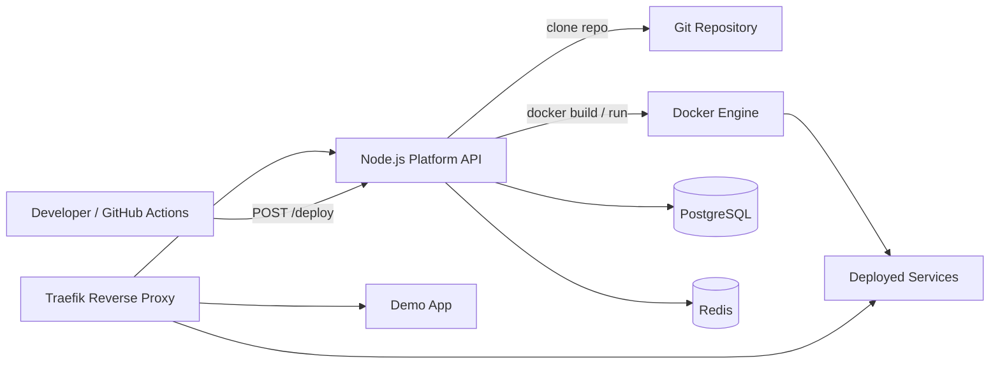

# Self-Hosted DevOps Platform

A self-hosted DevOps platform and mini PaaS for deploying containerized applications through an API-driven workflow. The platform combines a Node.js control plane, Docker-based builds, Traefik reverse proxy routing, PostgreSQL deployment metadata, and Redis-backed readiness validation to simulate a production-style platform engineering environment.

The project is designed to demonstrate practical DevOps skills: containerization, service orchestration, reverse proxy automation, health checks, infrastructure automation, and reproducible local environments.

## Architecture



### Components

- **API**: Express control plane exposing `/health`, `/ready`, and `/deploy`.
- **Traefik**: Reverse proxy that discovers containers dynamically through Docker labels.
- **PostgreSQL**: Durable deployment metadata and status storage.
- **Redis**: Fast deployment status cache and readiness dependency.
- **Docker Compose**: Local orchestration for API, Traefik, PostgreSQL, Redis, and demo services.

## Features

- API-driven deployment workflow with `POST /deploy`.
- Docker image builds from Git repositories.
- Automatic container replacement by service name.
- Dynamic domain-based routing via Traefik labels.
- Multi-service routing with `api.localhost`, `app.localhost`, and deployed app domains.
- Liveness and readiness endpoints.
- PostgreSQL and Redis dependency validation.
- Reproducible Docker Compose environment.
- Optional Prometheus and Grafana observability profile.
- GitHub Actions workflow for CI/CD integration.

## How It Works

1. A developer pushes code or triggers CI/CD.
2. GitHub Actions sends a `POST /deploy` request to the platform API.
3. The API validates `repo`, `name`, and `domain`.
4. The API clones the Git repository into a deployment workspace.
5. Docker builds an image from the cloned repository.
6. Any existing container with the same app name is stopped and removed.
7. A new container is started on the Traefik network.
8. Traefik discovers the container through labels and routes traffic to the configured domain.

## Getting Started

Clone the repository:

```sh
git clone https://github.com/semihbugrasezer/self-hosted-devops.git
cd self-hosted-devops
```

Start the platform:

```sh
docker compose up -d --build
```

If ports `80` or `8080` are already used:

```sh
TRAEFIK_HTTP_PORT=8088 TRAEFIK_DASHBOARD_PORT=8089 docker compose up -d --build
```

Check containers:

```sh
docker compose ps
```

Test the API through Traefik:

```sh
curl -H "Host: api.localhost" http://127.0.0.1:8088/health
curl -H "Host: api.localhost" http://127.0.0.1:8088/ready
```

Test the demo app:

```sh
curl -H "Host: app.localhost" http://127.0.0.1:8088/
```

## API Endpoints

### `GET /health`

Liveness check. Confirms that the API process is running.

```sh
curl http://api.localhost/health
```

Expected response:

```json
{
  "status": "ok",
  "service": "devops-api"
}
```

### `GET /ready`

Readiness check. Confirms that PostgreSQL and Redis are reachable.

```sh
curl http://api.localhost/ready
```

Expected response:

```json
{
  "status": "ready",
  "ready": true,
  "dependencies": {
    "postgres": { "status": "connected" },
    "redis": { "status": "connected" }
  }
}
```

### `POST /deploy`

Deploys a Dockerized application from a Git repository.

```json
{
  "repo": "https://github.com/user/app.git",
  "name": "myapp",
  "domain": "myapp.localhost"
}
```

Example:

```sh
curl -X POST http://api.localhost/deploy \
  -H "Content-Type: application/json" \
  -d '{
    "repo": "https://github.com/user/app.git",
    "name": "myapp",
    "domain": "myapp.localhost"
  }'
```

Local sample deployment:

```sh
curl -fsS -H "Host: api.localhost" \
  -H "Content-Type: application/json" \
  -X POST http://127.0.0.1:8088/deploy \
  -d '{
    "repo": "file:///sample-service",
    "name": "sample",
    "domain": "sample.localhost"
  }'
```

Test the deployed sample:

```sh
curl -H "Host: sample.localhost" http://127.0.0.1:8088/
```

Expected response:

```json
{
  "service": "sample-service",
  "message": "deployed by the self-hosted DevOps platform"
}
```

## Screenshots / Demo

Recommended assets to add to this repository:

- **Traefik dashboard** showing routers for `api.localhost`, `app.localhost`, and deployed apps.
- **Terminal GIF** showing `POST /deploy` followed by a successful `curl` to the deployed domain.
- **Docker Desktop screenshot** showing platform containers and a deployed application container.
- **GitHub Actions screenshot** showing a successful CI/CD workflow.

Suggested demo output:

```text
POST /deploy -> deployment completed
sample.localhost -> {"service":"sample-service","message":"deployed by the self-hosted DevOps platform"}
```

## DevOps Concepts Demonstrated

- **Containerization**: Applications are packaged and deployed as Docker images.
- **Service orchestration**: Docker Compose coordinates API, database, cache, reverse proxy, and demo services.
- **Reverse proxy routing**: Traefik exposes services through domain-based routing.
- **Infrastructure automation**: Deployments are triggered through an API instead of manual container commands.
- **Observability basics**: Health checks, readiness checks, container logs, and optional monitoring stack.
- **Reproducibility**: The platform runs from version-controlled Docker and Compose configuration.

## CI/CD

The included GitHub Actions workflow validates the API and builds the Docker image. It can also trigger the deployment API after a push.

Set this repository variable in GitHub:

```text
DEPLOY_WEBHOOK_URL=http://your-platform-domain/deploy
```

For public environments, protect this endpoint with authentication and TLS before exposing it.

## Observability

View logs:

```sh
docker compose logs -f api
docker compose logs -f traefik
```

Start optional monitoring:

```sh
docker compose --profile observability up -d --build
```

Services:

```text
Prometheus: http://localhost:9090
Grafana: http://localhost:3001
```

## Codebase Improvements

- **Folder structure**: Move deployment logic from `api/server.js` into modules such as `routes/deploy.js`, `services/docker.js`, and `services/git.js`.
- **Environment management**: Keep `.env.example` committed, avoid committing real secrets, and validate required environment variables on startup.
- **Logging**: Continue structured JSON logs and add deployment IDs to every log line for easier troubleshooting.
- **Error handling**: Add typed errors for validation, Git failures, Docker build failures, and container runtime failures.
- **Security**: Add authentication to `/deploy`, restrict allowed repository origins, and replace direct Docker socket access with a Docker socket proxy.

## Future Improvements

- Add blue/green or canary deployments for safer rollouts.
- Push built images to a registry before deployment.
- Add TLS certificates with Let's Encrypt.
- Add Prometheus metrics and Grafana dashboards for deployment and runtime visibility.
- Add GitHub Actions deployment environments and approval gates.
- Add image vulnerability scanning with Trivy.
- Migrate the runtime layer to Kubernetes with Ingress, Deployments, Services, and Helm.
- Add Terraform for provisioning cloud infrastructure.

## CV Impact

- Built a self-hosted mini PaaS using Node.js, Docker, Docker Compose, Traefik, PostgreSQL, and Redis to automate application deployment through an API-driven workflow.
- Implemented dynamic reverse proxy routing with Traefik labels, containerized service orchestration, health/readiness checks, and reproducible local infrastructure.
- Designed a DevOps portfolio platform demonstrating CI/CD integration, deployment automation, observability fundamentals, and production-oriented infrastructure patterns.
