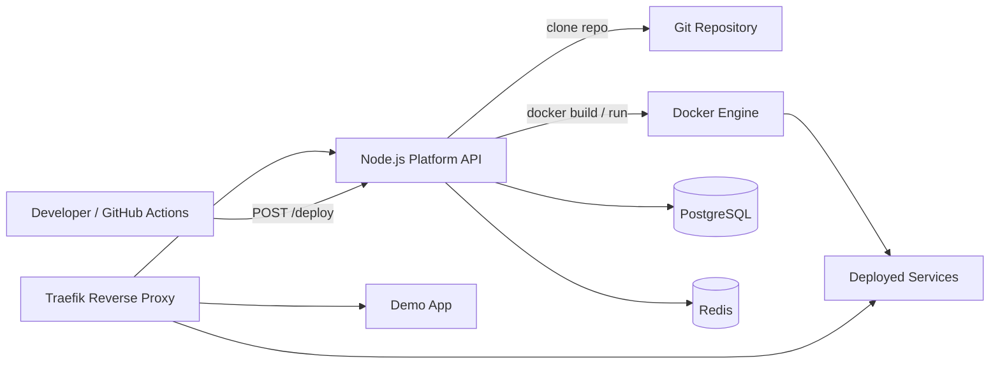

# Self-Hosted DevOps Platform

A self-hosted DevOps platform and mini PaaS for deploying containerized applications through an API-driven workflow. The platform combines a Node.js control plane, Docker-based builds, Traefik reverse proxy routing, PostgreSQL deployment metadata, and Redis-backed readiness validation to simulate a production-style platform engineering environment.

The project is designed to demonstrate practical DevOps skills: containerization, service orchestration, reverse proxy automation, health checks, infrastructure automation, and reproducible local environments.

## Architecture



### Components

- **API**: Express control plane exposing `/health`, `/ready`, and `/deploy`.
- **Traefik**: Reverse proxy that discovers containers dynamically through Docker labels.
- **Docker socket proxy**: Restricts Docker API access used by Traefik and the deployment controller.
- **PostgreSQL**: Durable deployment metadata and status storage.
- **Redis**: Fast deployment status cache and readiness dependency.
- **Docker Compose**: Local orchestration for API, Traefik, PostgreSQL, Redis, and demo services.

## Features

- API-driven deployment workflow with `POST /deploy`.
- Docker image builds from Git repositories.
- Blue/green-style candidate validation before replacing the routed container.
- Optional image registry tagging and push before deployment.
- Automatic container replacement by service name.
- Dynamic domain-based routing via Traefik labels.
- Multi-service routing with `api.localhost`, `app.localhost`, and deployed app domains.
- Liveness and readiness endpoints.
- PostgreSQL and Redis dependency validation.
- Protected deploy endpoint with bearer-token authentication.
- Repository allowlist through `DEPLOY_ALLOWED_REPO_PREFIXES`.
- Reproducible Docker Compose environment.
- Optional Prometheus and Grafana observability profile.
- Trivy image vulnerability scanning in CI.
- Traefik ACME/Let's Encrypt configuration for production TLS.
- GitHub Actions workflow for CI/CD integration.

## How It Works

1. A developer pushes code or triggers CI/CD.
2. GitHub Actions sends a `POST /deploy` request to the platform API.
3. The API validates `repo`, `name`, and `domain`.
4. The API clones the Git repository into a deployment workspace.
5. Docker builds an image from the cloned repository.
6. A candidate container is started and health-checked before routing changes.
7. The previous routed container is replaced only after the candidate passes validation.
8. Traefik discovers the new container through labels and routes traffic to the configured domain.

## Getting Started

Clone the repository:

```sh
git clone https://github.com/semihbugrasezer/self-hosted-devops.git
cd self-hosted-devops
```

Start the platform:

```sh
docker compose up -d --build
```

If ports `80` or `8080` are already used:

```sh
TRAEFIK_HTTP_PORT=8088 TRAEFIK_DASHBOARD_PORT=8089 docker compose up -d --build
```

Check containers:

```sh
docker compose ps
```

Test the API through Traefik:

```sh
curl -H "Host: api.localhost" http://127.0.0.1:8088/health
curl -H "Host: api.localhost" http://127.0.0.1:8088/ready
```

Test the demo app:

```sh
curl -H "Host: app.localhost" http://127.0.0.1:8088/
```

## API Endpoints

### `GET /health`

Liveness check. Confirms that the API process is running.

```sh
curl http://api.localhost/health
```

Expected response:

```json
{
  "status": "ok",
  "service": "devops-api"
}
```

### `GET /ready`

Readiness check. Confirms that PostgreSQL and Redis are reachable.

```sh
curl http://api.localhost/ready
```

Expected response:

```json
{
  "status": "ready",
  "ready": true,
  "dependencies": {
    "postgres": { "status": "connected" },
    "redis": { "status": "connected" }
  }
}
```

### `POST /deploy`

Deploys a Dockerized application from a Git repository.

```json
{
  "repo": "https://github.com/user/app.git",
  "name": "myapp",
  "domain": "myapp.localhost"
}
```

Example:

```sh
curl -X POST http://api.localhost/deploy \
  -H "Content-Type: application/json" \
  -H "Authorization: Bearer local-dev-token" \
  -d '{
    "repo": "https://github.com/user/app.git",
    "name": "myapp",
    "domain": "myapp.localhost"
  }'
```

Local sample deployment:

```sh
curl -fsS -H "Host: api.localhost" \
  -H "Content-Type: application/json" \
  -H "Authorization: Bearer local-dev-token" \
  -X POST http://127.0.0.1:8088/deploy \
  -d '{
    "repo": "file:///sample-service",
    "name": "sample",
    "domain": "sample.localhost"
  }'
```

Test the deployed sample:

```sh
curl -H "Host: sample.localhost" http://127.0.0.1:8088/
```

Expected response:

```json
{
  "service": "sample-service",
  "message": "deployed by the self-hosted DevOps platform"
}
```

## Screenshots / Demo

Recommended assets to add to this repository:

- **Traefik dashboard** showing routers for `api.localhost`, `app.localhost`, and deployed apps.
- **Terminal GIF** showing `POST /deploy` followed by a successful `curl` to the deployed domain.
- **Docker Desktop screenshot** showing platform containers and a deployed application container.
- **GitHub Actions screenshot** showing a successful CI/CD workflow.

Suggested demo output:

```text
POST /deploy -> deployment completed
sample.localhost -> {"service":"sample-service","message":"deployed by the self-hosted DevOps platform"}
```

## DevOps Concepts Demonstrated

- **Containerization**: Applications are packaged and deployed as Docker images.
- **Service orchestration**: Docker Compose coordinates API, database, cache, reverse proxy, and demo services.
- **Reverse proxy routing**: Traefik exposes services through domain-based routing.
- **Infrastructure automation**: Deployments are triggered through an API instead of manual container commands.
- **Observability basics**: Health checks, readiness checks, structured logs, Prometheus metrics, and Grafana dashboards.
- **Security basics**: Deploy auth, repository allowlisting, Trivy scanning, and a Docker socket proxy instead of direct socket access.
- **Reproducibility**: The platform runs from version-controlled Docker and Compose configuration.

## CI/CD

The included GitHub Actions workflow validates the API and builds the Docker image. It can also trigger the deployment API after a push.

Set this repository variable in GitHub:

```text
DEPLOY_WEBHOOK_URL=http://your-platform-domain/deploy
```

For public environments, protect this endpoint with authentication and TLS before exposing it.

Required CI/CD configuration:

```text
DEPLOY_WEBHOOK_URL=http://your-platform-domain/deploy
DEPLOY_TOKEN=<same token configured on the platform>
```

## Observability

View logs:

```sh
docker compose logs -f api
docker compose logs -f traefik
```

Start optional monitoring:

```sh
docker compose --profile observability up -d --build
```

Services:

```text
Prometheus: http://localhost:9090
Grafana: http://localhost:3001
```

The API exposes Prometheus metrics at:

```text
GET /metrics
```

## Implemented Engineering Improvements

- **Modular API structure**: Deployment logic is split into `routes`, `services`, `middleware`, `config`, `db`, `errors`, and `utils`.
- **Environment validation**: Runtime configuration is centralized in `api/src/config`, with documented variables in `.env.example` and `api/.env.example`.
- **Structured logging**: JSON logs include request metadata and deployment IDs across Git, Docker build, image push, container validation, and runtime steps.
- **Typed error handling**: Validation, Git, Docker build, container runtime, and authentication failures are represented with dedicated error classes.
- **Security controls**: `/deploy` supports bearer-token authentication, repository allowlisting, and Docker API access through a socket proxy.
- **Blue/green-style rollout**: New deployments are first started as candidate containers and health-checked before replacing the routed container.
- **Registry-ready builds**: Deployments can optionally tag and push images to an external registry with `DEPLOY_IMAGE_REGISTRY` and `DEPLOY_PUSH_IMAGES`.
- **CI security scanning**: GitHub Actions includes Trivy image scanning for high and critical vulnerabilities.
- **Observability**: The API exposes Prometheus metrics, and Grafana dashboard provisioning is included.
- **Infrastructure scaffolding**: Kubernetes manifests and Terraform resources are included for moving beyond local Docker Compose.

## Roadmap

- Add true weighted canary traffic shifting through Traefik weighted services or a Kubernetes progressive delivery controller.
- Add a dedicated deployment history and audit API with filtering, retention, and operator-friendly event timelines.
- Add production secret management with SOPS, Vault, Doppler, or cloud-native secret stores.
- Replace direct Docker runtime deployment with Kubernetes Deployments, Services, Ingress, and Argo Rollouts or Flagger.
- Expand Terraform into reusable modules for managed PostgreSQL, managed Redis, backups, DNS, alerts, and monitoring.

## CV Impact

- Built a self-hosted mini PaaS using Node.js, Docker, Docker Compose, Traefik, PostgreSQL, and Redis to automate application deployment through an API-driven workflow.
- Implemented dynamic reverse proxy routing with Traefik labels, containerized service orchestration, health/readiness checks, and reproducible local infrastructure.
- Designed a DevOps portfolio platform demonstrating CI/CD integration, deployment automation, observability fundamentals, and production-oriented infrastructure patterns.
