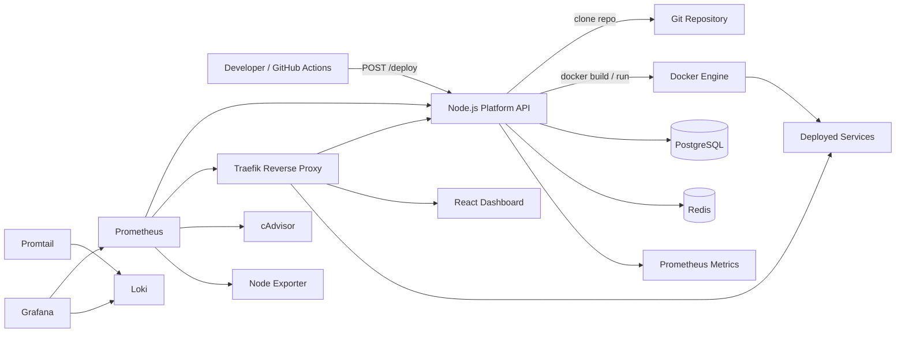
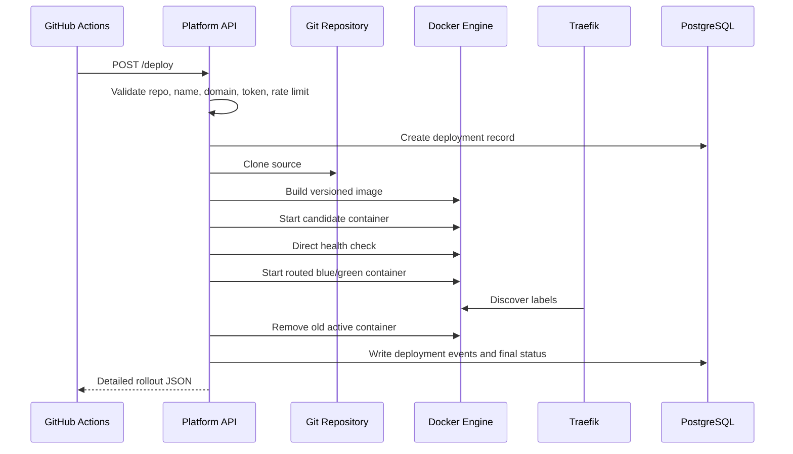

# Self-Hosted DevOps Platform

[](https://github.com/semihbugrasezer/self-hosted-devops/actions/workflows/ci-cd.yml)
[](docker-compose.yml)
[](prometheus/prometheus.yml)
[](terraform/main.tf)

A self-hosted DevOps platform and mini PaaS for deploying containerized applications through an API-driven workflow. The platform combines a Node.js control plane, Docker-based builds, Traefik reverse proxy routing, PostgreSQL deployment metadata, and Redis-backed readiness validation to simulate a production-style platform engineering environment.

The project is designed to demonstrate practical DevOps skills: containerization, service orchestration, reverse proxy automation, health checks, infrastructure automation, and reproducible local environments.

## Architecture



### Components

- **API**: Express control plane exposing `/health`, `/ready`, and `/deploy`.
- **Traefik**: Reverse proxy that discovers containers dynamically through Docker labels.
- **Docker socket proxy**: Restricts Docker API access used by Traefik and the deployment controller.
- **PostgreSQL**: Durable deployment metadata and status storage.
- **Redis**: Fast deployment status cache and readiness dependency.
- **Prometheus, Grafana, Loki, Promtail**: Metrics, dashboards, alerts, and container log aggregation.
- **cAdvisor and Node Exporter**: Container and host CPU/memory telemetry.
- **React dashboard**: Operator UI for health, readiness, deployment history, event timelines, logs, and observability links.
- **Docker Compose**: Local orchestration for API, Traefik, PostgreSQL, Redis, dashboard, and demo services.

## Features

- API-driven deployment workflow with `POST /deploy`.
- React dashboard exposed at `app.localhost`.
- Dashboard views for `/health`, `/ready`, deployment history, deployment details, event timelines, and platform logs.
- Persisted deployment status and event history.
- Docker image builds from Git repositories.
- Blue/green-style candidate validation before replacing the routed container.
- Optional image registry tagging and push before deployment.
- Automatic container replacement by service name.
- Dynamic domain-based routing via Traefik labels.
- Multi-service routing with `api.localhost`, `app.localhost`, `worker.localhost`, and deployed app domains.
- Liveness and readiness endpoints.
- PostgreSQL and Redis dependency validation.
- Protected deploy endpoint with bearer-token authentication.
- Basic `/deploy` rate limiting with response headers.
- Repository allowlist through `DEPLOY_ALLOWED_REPO_PREFIXES`.
- Reproducible Docker Compose environment.
- Prometheus metrics for request count, latency, process CPU, process memory, Traefik traffic, host CPU, and container memory.
- Grafana dashboards for API, routing, infrastructure, and logs.
- Loki and Promtail log aggregation for request, error, and deployment logs.
- Alertmanager with basic API availability, latency, 5xx, and memory alerts.
- Trivy image vulnerability scanning in CI.
- Traefik ACME/Let's Encrypt configuration for production TLS.
- GitHub Actions workflow for test, Docker build, Compose validation, Trivy scanning, and deploy API triggering.
- Kubernetes manifests with rolling updates, resource limits, HPA, PDB, Service, and Ingress examples.
- Terraform infrastructure definition for a cloud container host, firewall, SSH key, and DNS record.

## How It Works

1. A developer pushes code or triggers CI/CD.
2. GitHub Actions sends a `POST /deploy` request to the platform API.
3. The API validates `repo`, `name`, and `domain`.
4. The API clones the Git repository into a deployment workspace.
5. Docker builds an image from the cloned repository.
6. A candidate container is started without Traefik routing and health-checked directly.
7. A versioned routed container is started while the previous active container remains available.
8. The old active container is removed only after the new routed container passes validation.
9. Deployment events are written to PostgreSQL for auditability.
10. Traefik discovers the new container through labels and routes traffic to the configured domain.

## Deployment Flow



## Getting Started

Clone the repository:

```sh
git clone https://github.com/semihbugrasezer/self-hosted-devops.git
cd self-hosted-devops
```

Start the platform:

```sh
docker compose up -d --build
```

If ports `80` or `8080` are already used:

```sh
TRAEFIK_HTTP_PORT=8088 TRAEFIK_DASHBOARD_PORT=8089 docker compose up -d --build
```

Check containers:

```sh
docker compose ps
```

Test the API through Traefik:

```sh
curl -H "Host: api.localhost" http://127.0.0.1:8088/health
curl -H "Host: api.localhost" http://127.0.0.1:8088/ready
```

Open the dashboard:

```sh
curl -H "Host: app.localhost" http://127.0.0.1:8088/
```

The dashboard shows API liveness, readiness, deployments, deployment details, event timelines, runtime logs, and quick links to Grafana, Prometheus, Loki, and Traefik.

Test the worker demo service:

```sh
curl -H "Host: worker.localhost" http://127.0.0.1:8088/
```

Run the dashboard locally during UI development:

```sh
cd app
npm install
npm run dev
```

The production dashboard container is built from `app/Dockerfile`. It serves the React build with nginx and proxies `/api/platform/*` to the API service inside Docker Compose.

## API Endpoints

### `GET /health`

Liveness check. Confirms that the API process is running.

```sh
curl http://api.localhost/health
```

Expected response:

```json
{
  "status": "ok",
  "service": "devops-api"
}
```

### `GET /ready`

Readiness check. Confirms that PostgreSQL and Redis are reachable.

```sh
curl http://api.localhost/ready
```

Expected response:

```json
{
  "status": "ready",
  "ready": true,
  "dependencies": {
    "postgres": { "status": "connected" },
    "redis": { "status": "connected" }
  }
}
```

### `GET /system/status`

Returns a dashboard-friendly platform summary with service uptime and dependency state.

```sh
curl http://api.localhost/system/status
```

### `POST /deploy`

Deploys a Dockerized application from a Git repository.

```json
{
  "repo": "https://github.com/user/app.git",
  "name": "myapp",
  "domain": "myapp.localhost"
}
```

Example:

```sh
curl -X POST http://api.localhost/deploy \
  -H "Content-Type: application/json" \
  -H "Authorization: Bearer local-dev-token" \
  -d '{
    "repo": "https://github.com/user/app.git",
    "name": "myapp",
    "domain": "myapp.localhost"
  }'
```

Local sample deployment:

```sh
curl -fsS -H "Host: api.localhost" \
  -H "Content-Type: application/json" \
  -H "Authorization: Bearer local-dev-token" \
  -X POST http://127.0.0.1:8088/deploy \
  -d '{
    "repo": "file:///sample-service",
    "name": "sample",
    "domain": "sample.localhost"
  }'
```

Test the deployed sample:

```sh
curl -H "Host: sample.localhost" http://127.0.0.1:8088/
```

Expected response:

```json
{
  "service": "sample-service",
  "message": "deployed by the self-hosted DevOps platform"
}
```

Deployment responses include:

- `deployment`: persisted status, image tag, domain, container names, and error field.
- `rollout`: blue/green rollout metadata, previous containers, router name, health path, and active container.
- `events`: ordered deployment audit events for clone, build, validation, promotion, cleanup, and failure handling.

### `GET /deployments`

Returns the latest deployment records.

```sh
curl http://api.localhost/deployments
```

### `GET /deployments/:id`

Returns deployment metadata and persisted event history.

```sh
curl http://api.localhost/deployments/<deployment-id>
```

### `GET /logs?service=api`

Returns recent container logs for dashboard inspection. Supported services are `api`, `traefik`, `app`, `worker`, `postgres`, and `redis`.

```sh
curl "http://api.localhost/logs?service=api&tail=120"
```

## Screenshots / Demo

Recommended assets to add to this repository:

- `docs/screenshots/dashboard-overview.png`: React dashboard with health, readiness, deployment status cards, and logs.
- `docs/screenshots/deployment-timeline.png`: deployment detail view with event timeline and active container metadata.
- `docs/screenshots/grafana-dashboard.png`: Grafana dashboard with API latency, request rate, CPU, memory, and logs.
- `docs/screenshots/traefik-dashboard.png`: Traefik routers for `api.localhost`, `app.localhost`, `worker.localhost`, and deployed apps.
- `docs/screenshots/github-actions-success.png`: successful CI/CD workflow.
- `docs/demo/deployment-flow.gif`: `POST /deploy`, dashboard deployment update, and a successful `curl` to the deployed domain.

Suggested demo output:

```text
POST /deploy -> deployment completed
sample.localhost -> {"service":"sample-service","message":"deployed by the self-hosted DevOps platform"}
```

## DevOps Concepts Demonstrated

- **Containerization**: Applications are packaged and deployed as Docker images.
- **Service orchestration**: Docker Compose coordinates API, database, cache, reverse proxy, and demo services.
- **Reverse proxy routing**: Traefik exposes services through domain-based routing.
- **Infrastructure automation**: Deployments are triggered through an API instead of manual container commands.
- **Observability basics**: Health checks, readiness checks, structured logs, Prometheus metrics, and Grafana dashboards.
- **Security basics**: Deploy auth, repository allowlisting, Trivy scanning, and a Docker socket proxy instead of direct socket access.
- **Reproducibility**: The platform runs from version-controlled Docker and Compose configuration.

## CI/CD

The included GitHub Actions workflow demonstrates a production-style automation path:

1. Install dependencies with `npm ci`.
2. Lint the Node.js API.
3. Run basic tests.
4. Build the API Docker image.
5. Validate the Docker Compose topology.
6. Build the sample deployable service image.
7. Scan the image with Trivy for high and critical vulnerabilities.
8. Trigger `POST /deploy` automatically on pushes to `main`.

Set this repository variable in GitHub:

```text
DEPLOY_WEBHOOK_URL=http://your-platform-domain/deploy
```

For public environments, protect this endpoint with authentication and TLS before exposing it.

Required CI/CD configuration:

```text
DEPLOY_WEBHOOK_URL=http://your-platform-domain/deploy
DEPLOY_TOKEN=<same token configured on the platform>
```

## Observability

View raw container logs:

```sh
docker compose logs -f api
docker compose logs -f traefik
```

Start optional monitoring:

```sh
docker compose --profile observability up -d --build
```

Services:

```text
Prometheus: http://localhost:9090
Grafana: http://localhost:3001
Loki: http://localhost:3100
Alertmanager: http://localhost:9093
cAdvisor: http://localhost:8082
```

The API exposes Prometheus metrics at:

```text
GET /metrics
```

The Grafana dashboard includes:

- API request rate and p95 latency.
- Deployment count.
- Traefik routed request rate and 5xx errors.
- Container CPU and memory usage from cAdvisor.
- Host CPU usage from Node Exporter.
- Aggregated platform logs from Loki.

Promtail discovers Docker containers and ships JSON logs to Loki. API logs include request metadata, errors, deployment IDs, Git steps, Docker build steps, container validation, and rollout events.

## Dashboard

The `app/` service is a production-built React dashboard served by nginx. It is routed by Traefik at:

```text
http://app.localhost
```

When using alternate local ports:

```text
http://127.0.0.1:8088 with Host: app.localhost
```

Dashboard capabilities:

- Health and readiness status from `/health` and `/ready`.
- Platform summary from `/system/status`.
- Deployment list from `/deployments`.
- Deployment detail and event timeline from `/deployments/:id`.
- Runtime log terminal from `/logs?service=api`.
- Quick links to Grafana, Prometheus, Loki, and Traefik.

The dashboard nginx config proxies browser requests from `/api/platform/*` to the API container, so local Compose usage does not require CORS or public API exposure.

## Kubernetes

The `k8s/` directory shows how the API can move from local Docker Compose into Kubernetes:

- `api-deployment.yaml`: rolling updates with `maxUnavailable: 0`, probes, resource requests/limits, and non-root security context.
- `api-service.yaml`: stable internal service for the API pods.
- `api-ingress.yaml`: Traefik ingress with TLS annotation.
- `api-hpa.yaml`: CPU-based horizontal autoscaling.
- `api-pdb.yaml`: disruption budget to keep at least one pod available.

## Terraform

The `terraform/` directory defines a cloud-ready host layer using Infrastructure as Code:

- DigitalOcean project and VM.
- SSH key management.
- Firewall rules for SSH, HTTP, and HTTPS.
- Optional DNS `A` record for the API domain.

This keeps infrastructure configuration version-controlled and reviewable instead of relying on click-ops.

## Implemented Engineering Improvements

- **Modular API structure**: Deployment logic is split into `routes`, `services`, `middleware`, `config`, `db`, `errors`, and `utils`.
- **Environment validation**: Runtime configuration is centralized in `api/src/config`, with documented variables in `.env.example` and `api/.env.example`.
- **Structured logging**: JSON logs include request metadata and deployment IDs across Git, Docker build, image push, container validation, and runtime steps.
- **Deployment auditability**: PostgreSQL stores ordered deployment events for status tracking and operator review.
- **Operator dashboard**: React dashboard visualizes platform readiness, deployments, release metadata, event timelines, and logs.
- **Typed error handling**: Validation, Git, Docker build, container runtime, and authentication failures are represented with dedicated error classes.
- **Security controls**: `/deploy` supports bearer-token authentication, rate limiting, repository allowlisting, and Docker API access through a socket proxy.
- **Blue/green-style rollout**: New deployments are first started as candidate containers, then promoted as versioned routed containers before old releases are removed.
- **Registry-ready builds**: Deployments can optionally tag and push images to an external registry with `DEPLOY_IMAGE_REGISTRY` and `DEPLOY_PUSH_IMAGES`.
- **CI security scanning**: GitHub Actions includes Compose validation, Docker builds, sample image validation, and Trivy scanning for high and critical vulnerabilities.
- **Observability**: Prometheus, Grafana, Loki, Promtail, Alertmanager, cAdvisor, and Node Exporter are included under the observability profile.
- **Infrastructure scaffolding**: Kubernetes manifests and Terraform resources are included for moving beyond local Docker Compose.
- **Container hardening**: The API image runs as the non-root `node` user.

## Roadmap

- Add true weighted canary traffic shifting through Traefik weighted services or a Kubernetes progressive delivery controller.
- Add a dedicated deployment history and audit API with filtering, retention, and operator-friendly event timelines.
- Add production secret management with SOPS, Vault, Doppler, or cloud-native secret stores.
- Replace direct Docker runtime deployment with Kubernetes Deployments, Services, Ingress, and Argo Rollouts or Flagger.
- Expand Terraform into reusable modules for managed PostgreSQL, managed Redis, backups, DNS, alerts, and monitoring.

## CV Impact

- Built a self-hosted mini PaaS using Node.js, Docker, Docker Compose, Traefik, PostgreSQL, and Redis to automate application deployment through an API-driven workflow.
- Implemented dynamic reverse proxy routing with Traefik labels, containerized service orchestration, health/readiness checks, and reproducible local infrastructure.
- Designed a DevOps portfolio platform demonstrating CI/CD integration, deployment automation, observability fundamentals, and production-oriented infrastructure patterns.
